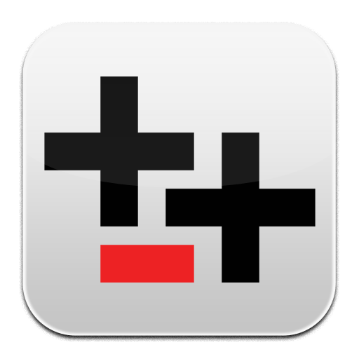

  

# Translator++ — Open-Source Game Translation & Localization Tool

**Translate games and visual novels with the machine translator, AI model, or local service of your choice—then review every line and export a playable translation.**

Translator++ is a Windows computer-assisted translation (CAT) tool built for game data. It extracts dialogue, choices, database text, scripts, subtitles, and other structured content into a context-aware workspace while protecting the codes and placeholders that keep a game working.

**[Download Translator++](https://dreamsavior.net/download/)** · [Getting started](https://dreamsavior.net/docs/translator/getting-started/installation/) · [Documentation](https://dreamsavior.net/docs/translator/) · [Discord](https://discord.gg/6Dv97C87xt) · [Issues](../../issues) · [Discussions](../../discussions)

> **Translate together in real time.** Enable **NetCollab** and use the one-click **Start Serving** action to host a Google Docs-like collaboration session from your own computer—without handing the project to a central translation service.

> **Repository status:** This is the public home of Translator++. The GPLv3-licensed public edition, developer documentation, issue tracking, and community contributions are published here as they become available.

[How it works](#from-game-folder-to-playable-translation) · [Why Translator++](#why-translator) · [Team collaboration](#real-time-team-collaboration-with-netcollab) · [Game engines](#supported-game-engines) · [File formats](#supported-files-and-content) · [Translators and AI](#machine-translation-ai-and-local-models) · [For developers](#automation-api-and-ai-agents) · [Download](#download-and-run) · [FAQ](#frequently-asked-questions)

## From game folder to playable translation

1. **Open a game or supported file.** Translator++ detects the format and extracts translatable content together with its original context.
2. **Choose how to translate.** Use a classic machine translator, a cloud AI provider, an OpenAI-compatible API, a local model, or existing translation memory.
3. **Review and refine—alone or together.** Compare candidates, edit any result, or enable NetCollab so teammates can work in the same project in real time.
4. **Export and test.** Export translated files, inject them into another game directory, or build the patch format required by the engine.

Whether you are translating a Japanese RPG Maker game into English, localizing a Ren'Py visual novel, or maintaining a multilingual game project, Translator++ keeps the work editable and the translator in control.

## Why Translator++?

- **One workspace for the whole localization cycle.** Extract, organize, translate, review, update, export, inject, and test without rebuilding the project in several unrelated tools.
- **Human-led, AI-assisted.** Machine translation and AI create editable drafts; you decide which translation is accepted.
- **Context where it matters.** Keep file paths, event locations, surrounding script, character names, parameters, comments, tags, and context-specific translations attached to each row.
- **Game syntax stays protected.** Configurable escape algorithms preserve variables, formatting codes, placeholders, and other inline control sequences during translation.
- **Bring your own translator.** Choose from dozens of integrations, connect an OpenAI-compatible or LiteLLM provider, use a local/offline workflow, or add another engine.
- **Collaborate without surrendering the project.** Use NetCollab's one-click serving action to host a real-time team workspace on your own computer.
- **More than dialogue.** Translate structured files, subtitles, spreadsheets, Windows resources, and text embedded in images.
- **Built for review and consistency.** Use translation memory, common references, actor references, proofreading, search, filters, tags, notes, and multiple translation candidates.
- **Open and extensible.** Automate work with JavaScript, build add-ons and custom parsers, or control the running application through its local JSON API and MCP server.

## Real-time team collaboration with NetCollab

**NetCollab brings Google Docs-like teamwork to Translator++.** One person hosts the open project, teammates join the session, and supported changes appear across the team in real time.

Starting a session is deliberately simple:

1. Open the project that your team will work on.
2. Choose **Tools → NetCollab → Start Serving**. NetCollab remembers the port for future sessions; a password is optional.
3. Share the host address with your teammates. They choose **Join Existing Server** and begin translating.

NetCollab synchronizes translation edits—including batch and automation-driven changes—along with tags, comments, notes, cell metadata, context-specific translations, and collaborator position indicators. The host retains ownership of project-level operations such as export, injection, and updating from the source game, which helps prevent conflicting structural changes.

### Self-hosted means your translation remains yours

The collaboration server runs inside Translator++ on the host's computer. This self-hosted architecture does not depend on a Translator++-operated cloud relay or translation database, and Translator++ does not cache, resell, or claim ownership of the content shared in the session. Project data travels directly between the host and the collaborators the host allows to join.

NetCollab supports network discovery, direct host connections, optional session passwords, presence indicators, and reconnection after interruptions.

## Supported game engines

Translator++ provides end-to-end parsers or established localization workflows for the following engine families.

| Engine / platform | What Translator++ can work with |
| --- | --- |
| **RPG Maker 2000 / 2003** | Extract and rebuild RPG Maker 2000 and 2003 game data. |
| **RPG Maker XP / VX / VX Ace** | Translate RGSS-based game data and scripts. |
| **RPG Maker MV / MZ** | Translate database JSON, events, system text, and JavaScript/plugin content. |
| **RPG Developer Bakin** | Extract, edit, and export supported Bakin localization data. |
| **Pixel Game Maker MV / Action Game Maker MV** | Work with game data through the dedicated parser workflow. |
| **Wolf RPG Editor** | Parse Wolf RPG data and map files and create translated output. |
| **Ren'Py** | Parse Ren'Py scripts and produce translated project content. |
| **KiriKiri / KAG** | Translate KiriKiri Adventure Game System scenarios and KAG/KS scripts. |
| **TyranoScript / TyranoBuilder** | Extract and rebuild Tyrano visual-novel scripts. |
| **NScripter / ONScripter** | Parse and export NScripter-family scripts and supported variants. |
| **Unity** | Work with supported Mono and IL2CPP content, RPG Maker Unite projects, and XUnity.AutoTranslator tables. |
| **Unreal Engine** | Extract supported localization resources and cooked-asset text and produce override output. |
| **Godot** | Extract supported localization text and produce an override package. |
| **SRPG Studio** | Translate SRPG Studio data with standard and alternative parser workflows. |
| **Artemis Engine** | Translate supported Artemis game resources and scripts. |
| **Action Editor 4** | Parse Action Editor 4 text for translation. |
| **YU-RIS** | Parse, edit, and rebuild YU-RIS visual-novel scripts. |
| **LiveMaker** | Translate LiveMaker games through `pylivemaker`. |
| **Light.vn** | Localize supported Light.vn visual novels. |
| **Additional visual-novel engines** | ArcGameEngine, Ethornell, CatSystem2, Cyberworks C / C-System, Musica, Propeller, RealLive, ShSystem, Qlie, SystemNNN, and WillPlus AdvHD. |

Support can vary between individual games, engine versions, custom encryption, plugins, and developer modifications. Always keep an untouched backup and test exported content in-game. If a game is not supported, Translator++ can often be extended with a [Custom Parser](#extend-translator) or parser add-on.

## Supported files and content

Translator++ can also create translation projects directly from common content formats.

| Content | Formats and workflow |
| --- | --- |
| **Images** | PNG, JPG/JPEG, WebP, BMP, and supported RPG Maker encrypted images (`.rpgmvp`, `.png_`) through OCR and the visual Image Translator. |
| **Subtitles and lyrics** | ASS, SSA, SRT, WebVTT/VTT, YouTube SBV, and LRC, with timing and structural fields preserved by Custom Parser templates. |
| **Structured and delimited data** | JSON, XML, HTML, INI, Java `.properties`, TSV, CSV, and custom text formats. |
| **Localization catalogs** | GNU gettext PO and MO. |
| **Spreadsheets** | XLS, XLSX, ODS, CSV, SYLK, Gnumeric, SpreadsheetML XML, and HTML tables. |
| **Documents and resources** | EPUB and supported Windows `.exe`, `.dll`, `.res`, and `.rc` resources. |
| **Custom scripts and formats** | Regular-expression extraction plus JavaScript hooks for formats without a built-in parser. |

## Machine translation, AI, and local models

A full Translator++ installation can register more than 60 translator-engine integrations. Availability, language pairs, quotas, and pricing are controlled by each provider, and some integrations require an API key, account, local program, or additional download.

| Category | Examples |
| --- | --- |
| **Cloud translation APIs** | DeepL, Google Cloud, Microsoft/Azure, IBM Watson, Baidu, Alibaba Cloud, Tencent Cloud, Huawei Cloud, Yandex Cloud, Youdao, and Volcengine. |
| **Generative AI** | OpenAI, Gemini, OpenAI-compatible APIs, LiteLLM, Bing AI, and batch-oriented LLM workflows. |
| **Local and offline workflows** | Sugoi Translator, GPT4All, KoboldAI-compatible servers, ezTrans/TransEZ, and supported on-device browser models. |
| **Web translation services** | Google, Bing, DeepL, Papago, Yandex, Reverso, Kakao, ModernMT, and other provider-specific integrations. |
| **Translation memory** | Reuse approved translations across rows and projects without sending the text to a machine translator again. |

Web-based and unofficial endpoints can change or become unavailable without notice. For predictable production work, use an official API or a local service appropriate for your project.

## A workspace designed for game text

Translator++ uses a spreadsheet-like CAT grid while preserving the structure around every string.

- Keep the original text and multiple translation candidates side by side.
- See file, event, speaker, actor, and surrounding-script context while translating.
- Give identical source text a different translation in different contexts.
- Add notes, comments, bookmarks, parameters, and colored review tags.
- Search, filter, find and replace, select ranges, track progress, and batch-process large projects.
- Protect RPG Maker control codes and other structured placeholders with configurable escape algorithms.
- Import existing work while retaining translations, tags, notes, context translations, and cell metadata.
- Export translated files, inject into a separate game directory, or generate engine-specific output.

## Translate text inside images

Image Translator brings image text into the same project as dialogue and structured data. It can:

- detect text with local OCR and preserve its coordinates;
- turn detected regions into normal translation rows;
- move, resize, rotate, align, wrap, and style translated text boxes;
- control fonts, colors, backgrounds, outlines, opacity, and visibility;
- remove original lettering with optional local LaMa inpainting through an on-demand ComfyUI runtime; and
- compose the translated image during export.

This makes it possible to localize signs, menus, title graphics, UI artwork, and dialogue embedded in images without separating them from the rest of the translation project.

## Automation, API, and AI agents

Repetitive localization work should be scriptable. Translator++ includes JavaScript CodeRunner workspaces for project-wide tasks, rows, grid selections, found cells, and object iteration. Scripts can edit content and metadata, call the application runtime, and generate their own input forms.

While Translator++ is running, local tools can connect through:

| Endpoint | Purpose |
| --- | --- |
| `GET http://127.0.0.1:22883/api/tools` | Discover the tools available in the current build. |
| `POST http://127.0.0.1:22883/api/call` | Call registered project, cell, translator, OCR, image, or automation tools. |
| `POST http://127.0.0.1:22883/api/exec` | Run advanced JavaScript inside the Translator++ application environment. |
| `POST http://127.0.0.1:22883/mcp` | Connect an MCP-capable client or AI agent through Streamable HTTP. |

The server is bound to localhost. Because `/api/exec` can execute arbitrary code in the application process, never expose port `22883` to untrusted networks.

## Extend Translator++

If your game or workflow is not supported, you do not have to wait for it to become a core feature.

- **Custom Parser:** define extraction and replacement with regular expressions and JavaScript, or start from an included format template.
- **Parser add-ons:** detect a game, extract strings with context, and implement export or injection through the parser framework.
- **Translator engines:** connect another web service, official API, OpenAI-compatible endpoint, or local model.
- **General add-ons:** add UI, commands, project processing, proofreaders, exporters, and integrations.
- **Agent tools:** register a tool once and expose it through both the local JSON API and MCP.

Generated API reference documentation is available in [`docs/`](docs/index.html). Additional developer guides are distributed with Translator++.

## Download and run

Translator++ is a semi-portable Windows application:

1. [Download the public version](https://dreamsavior.net/download/).
2. Extract the archive into its own folder. The password is always `Dreamsavior`
3. Run `Translator++.exe`.
4. Follow the [getting-started documentation](https://dreamsavior.net/docs/translator/) to create your first project.

The public download page provides both 64-bit and 32-bit Windows builds. Current published requirements are Windows 7 SP1 or later, 2 GB or more of RAM, approximately 1 GB of disk space, and the listed Microsoft Visual C++ redistributables. Larger games and optional local AI or image-processing components may require additional memory and disk space.

When upgrading, back up active projects and their staging files first. Some optional components and translation providers require internet access; local/offline workflows depend on the engine you choose.

## Frequently asked questions

### Is Translator++ free?

Yes. A public version is available free of charge. Supporters may receive earlier access to development builds and new features; see the [download page](https://dreamsavior.net/download/) for the current release channels.

### Do I need an API key?

Not for Translator++ itself. Individual translation services have their own requirements: some need an API key or account, while supported local and offline engines run on your computer.

### Will every game from a supported engine work?

No parser can guarantee compatibility with every customized or encrypted game. Engine versions, plugins, modified archives, and unusual scripts can require extra work. Keep an original backup, start with a small test, and report reproducible incompatibilities through [Issues](../../issues).

### Does Translator++ replace human translation?

I’m often tempted to build a one‑click translation tool. But the truth is, even frontier‑level AI still needs supervision — and often a full proofread. Translator++ was created to assist humans, not replace them.

That's why I made it GUI. Translator++ helps you extract, organize, draft, review, and reintegrate translations across complex game projects. Machine translation and AI output still require human judgment for meaning, tone, terminology, formatting, and the integrity of control codes. Translator++ makes that human‑in‑the‑loop workflow faster, safer, and more efficient.

## Contribute and get help

- Read the [Translator++ documentation](https://dreamsavior.net/docs/translator/).
- Ask workflow questions and meet other translators on [Discord](https://discord.gg/6Dv97C87xt).
- Report reproducible bugs or request features through [Issues](../../issues).
- Share ideas, parser research, and localization workflows in [Discussions](../../discussions).
- Contribute documentation corrections, parsers, translator integrations, add-ons, tests, and code improvements through pull requests.

Translator++ is licensed under the [GNU General Public License v3.0](LICENSE). Game-engine and translation-provider names belong to their respective owners. Translator++ is an independent project and is not affiliated with those vendors. Respect the licenses and distribution rights of every game and asset you translate.
