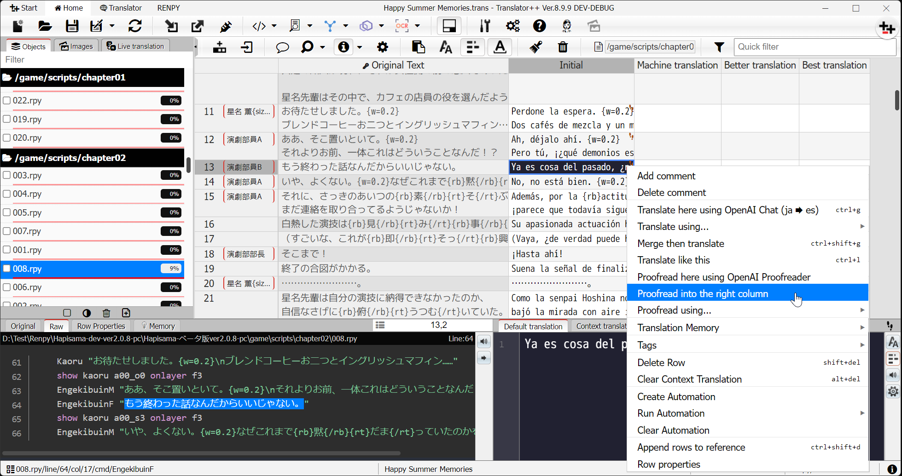
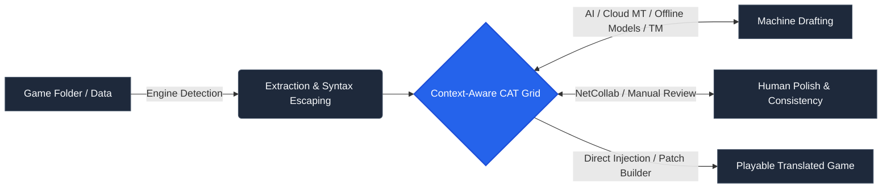
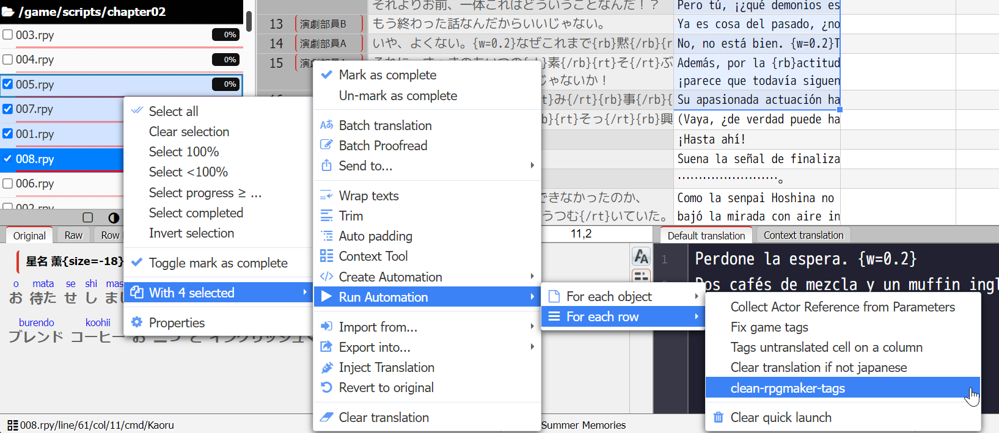

<p align="center">
  
</p>

<h1 align="center">Translator++</h1>
<h3 align="center">The Pioneer of Computer-Assisted Translation (CAT) Dedicated to Multiple Game Engines</h3>


<p align="center">
  <a href="https://github.com/dreamsavior/translator-plus-plus/releases"></a>
  <a href="LICENSE"></a>
  <a href="https://discord.gg/6Dv97C87xt"></a>
  <a href="https://dreamsavior.net/download/"></a>
</p>

<p align="center">
  <strong>Translate games and visual novels with modern AI, cloud APIs, or offline neural models—while preserving syntax, tags, and game integrity.</strong>
</p>

---

As the **pioneer of CAT software purpose-built for multi-engine game localization**, Translator++ is inspired by the battle-tested workflows of **professional localizers and passionate fan translators alike**. 

Instead of juggling generic spreadsheet tools and unstable extraction scripts, Translator++ extracts dialogue, choices, script commands, database arrays, and graphic subtitles into an editable, context-aware CAT grid. It shields sensitive game control sequences, escape codes, and variables while providing a unified platform for rapid AI drafting, terminology management, and human-in-the-loop review.

<p align="center">
  
</p>

<p align="center">
  <a href="https://dreamsavior.net/download/"><b>Download</b></a> •
  <a href="https://dreamsavior.net/docs/translator/getting-started/installation/"><b>Getting Started</b></a> •
  <a href="https://dreamsavior.net/docs/translator/"><b>Documentation</b></a> •
  <a href="https://discord.gg/6Dv97C87xt"><b>Discord Community</b></a> •
  <a href="#supported-game-engines"><b>Supported Engines</b></a>
</p>

> [!TIP]
> **Real-time multiplayer localization:** With **NetCollab**, you can host a collaborative, multi-user translation session directly from your local machine with one click—no external cloud server or third-party database required.

---

## Table of Contents
- [Why Translator++?](#why-translator)
- [How It Works](#from-game-folder-to-playable-translation)
- [Real-Time Team Collaboration (NetCollab)](#real-time-team-collaboration-with-netcollab)
- [Supported Game Engines](#supported-game-engines)
- [Supported File Types & Media](#supported-files-and-content)
- [Machine Translation, AI & Local Models](#machine-translation-ai-and-local-models)
- [In-Image Text Translation](#translate-text-inside-images)
- [Automation, Local API & MCP AI Agents](#automation-api-and-ai-agents)
- [Download & Installation](#download-and-run)
- [FAQ](#frequently-asked-questions)
- [Contributing & Community](#contribute-and-get-help)

---

## Why Translator++?

* **End-to-End Game Localization:** Extract, parse, draft, proofread, and inject strings directly into game folders without toggling between command-line extractors and spreadsheets.
* **Control Code & Syntax Preservation:** Configurable escaping algorithms ensure game syntax (`\c[2]`, `\v[1]`, `\n`, color tags, formatting variables) is shielded from machine translators and accidental editing.
* **Context-Rich Workspace:** Review strings alongside their event maps, file paths, speaker names, actor metadata, and surrounding dialogue context.
* **Context-Sensitive Translations:** Assign distinct translations to identical source strings depending on where and how they appear in-game.
* **Decoupled AI & MT Providers:** Integrate any translation backend: commercial APIs (DeepL, Google, Azure), local engines (Sugoi, KoboldAI), or cutting-edge LLMs (OpenAI, Anthropic, Gemini, LiteLLM).
* **In-Image Localization:** Perform OCR extraction, translation, typography styling, and inpainting removal (via local LaMa/ComfyUI) entirely inside the tool.
* **Extensible & Scriptable:** Built-in JavaScript CodeRunner, a local REST API, and Model Context Protocol (MCP) server endpoints allow full external automation by AI agents or custom pipelines.

---

## From Game Folder to Playable Translation



1. **Import:** Select a game executable or supported data folder. Translator++ identifies the engine, unpacks protected archives when supported, and imports translatable strings.
2. **Translate:** Populate initial drafts via connected AI endpoints, neural translation models, or translation memory (TM).
3. **Refine & Collaborate:** Proofread strings, compare multiple AI candidates side-by-side, adjust glossaries, or invite peers via NetCollab.
4. **Build & Test:** Directly inject localized text into the project or export an engine-ready patch for distribution.

---

## Real-Time Team Collaboration with NetCollab

**NetCollab brings real-time collaborative editing to game localization.** One translator hosts the project, and team members join over a local network or direct IP connection.

1. Open your project in Translator++.
2. Navigate to **Tools → NetCollab → Start Serving**.
3. Share your IP/port (and optional password) with your team. Collaborators click **Join Existing Server** to begin work.

### Self-Hosted, Private, and Decentralized
* **Zero Cloud Lock-in:** All project files stay on the host machine. No text is cached, analyzed, or stored on intermediary servers.
* **Real-Time Sync:** Synchronizes cell edits, reviewer notes, color tags, metadata, and collaborator cursor locations.
* **Host Authority:** High-impact operations (file injection, rebuilds, game updates) remain restricted to the host to eliminate file collisions.

---

## Supported Game Engines

Translator++ features native parsers and extraction workflows for many popular game engines and visual novel development environments:

| Engine / Platform | Capabilities & Scope |
| :--- | :--- |
| **RPG Maker (2000, 2003)** | Extracts LDB/LMT/LMU map data, events, and dialog; rebuilds clean binary records. |
| **RPG Maker (XP, VX, VX Ace)** | Full RGSS1/2/3 script and data parsing, event extraction, and rebuild support. |
| **RPG Maker (MV, MZ)** | Direct JSON parsing, plugin configuration parsing, system terms, and JS event extraction. |
| **Wolf RPG Editor** | Decodes Wolf data files (`.wolf`/`.dat`), map events, and string tables into clean text grids. |
| **Ren'Py** | Parses `.rpy` scripts, handles dialogue blocks, screen files, menus, and localization templates. |
| **TyranoScript / TyranoBuilder** | Extracts scene files (`.ks`), script commands, and UI strings with export validation. |
| **Unity (Mono / IL2CPP)** | Parses supported game assemblies, text assets, RPG Maker Unite structures, and XUnity tables. |
| **Unreal Engine** | Extracts supported localization text manifests and cooked string assets. |
| **Godot Engine** | Extracts CSV/PO localization files and project string resources. |
| **KiriKiri / KAG (`.ks`)** | Decodes and rebuilds KiriKiri Adventure Game system files and scenario data. |
| **Visual Novel Engines** | Native/community support for Artemis, NScripter/ONScripter, SRPG Studio, Bakin, Action Editor 4, LiveMaker, YU-RIS, Light.vn, Ethornell, CatSystem2, Qlie, and SystemNNN. |

> [!NOTE]
> Custom game-specific encryption, binary packers, or deeply altered plugins may require pre-unpacking or a [Custom Parser script](#extend-translator).

---

## Supported Files and Content

Translator++ functions as a flexible general-purpose CAT tool for non-game assets:

* **Subtitles & Timed Text:** ASS, SSA, SRT, WebVTT (`.vtt`), YouTube SBV, and LRC lyrics files (timing tags fully preserved).
* **Structured Data:** JSON, XML, HTML, INI, CSV, TSV, and Java `.properties`.
* **Catalogs & Spreadsheets:** GNU gettext (`.po`/`.mo`), Microsoft Excel (`.xlsx`, `.xls`), OpenDocument (`.ods`), and Gnumeric.
* **Binaries & Resources:** Windows Portable Executables (`.exe`, `.dll`), `.res`, and `.rc` string resources.
* **Graphic Text (OCR):** Embedded text in PNG, JPG, WebP, BMP, and encrypted RPG Maker formats (`.rpgmvp`, `.png_`).

---

## Machine Translation, AI, and Local Models

Translator++ interfaces with more than **60 translation and language model providers**:

| Service Type | Integrated Providers |
| :--- | :--- |
| **Commercial APIs** | DeepL Pro/Free, Google Cloud Translation, Microsoft Azure, Baidu, Tencent, Alibaba Cloud, Yandex Cloud. |
| **Generative AI & LLMs** | OpenAI (GPT-4o, GPT-3.5), Anthropic Claude, Google Gemini, LiteLLM, and any OpenAI-compatible API gateway. |
| **Local / Offline AI** | Sugoi Translator (Offline Japanese neural model), GPT4All, KoboldAI, TransEZ/ezTrans. |
| **Web Services** | Papago, Reverso, ModernMT, Kakao, and standard public web translation endpoints. |
| **Translation Memory (TM)** | Local indexing engine to instantly match and auto-populate recurring phrases. |

---

## Translate Text Inside Images

Localize game artwork, signs, title screens, and user interfaces without opening a separate image editing suite:


* **Local OCR:** Automatically detects text coordinates and injects regions directly into your translation grid.
* **Typography Control:** Customize font families, alignments, drop shadows, outlines, line wrapping, and rotation angles.
* **LaMa Inpainting:** Cleanly erase original source text in the background via local ComfyUI/LaMa runtime integration.

---

## Automation, API, and AI Agents

Translator++ is built to fit into modern automation pipelines:

* **JavaScript Automation:** Write and execute scripts inside Translator++ to batch‑manipulate rows, perform regex‑based terminology replacements, sanitize tags, and much more — making the possibilities virtually limitless.

<p align="center">
  
</p>

* **Local REST API:** Query or mutate grid state via HTTP requests while the application is running:
  * `GET /api/tools` — Introspect registered automation endpoints.
  * `POST /api/call` — Execute cell edits, trigger batch machine translation, or run OCR queries.
  * `POST /api/exec` — Run arbitrary JavaScript within the active application context.
* **Model Context Protocol (MCP):** Connect your favorite AI agents (like Claude Desktop, Cursor, or local orchestrators) directly to the running application via `/mcp`.

---

## Download and Run

Translator++ is distributed as a portable Windows application:

1. **[Download the Latest Build](https://dreamsavior.net/download/)**
2. Extract the archive into a dedicated directory.

> [!IMPORTANT]
> Official release archives are protected. The extraction password is:
> **`Dreamsavior`**

3. Launch `Translator++.exe`.
4. Follow the **[Quick-Start Guide](https://dreamsavior.net/docs/translator/getting-started/installation/)** to set up your first game project.

### System Requirements
* **OS:** Windows 10, 11 (or Windows 7 SP1+ with runtime updates), 64-bit recommended.
* **RAM:** Minimum 2 GB (4 GB+ recommended for large games or extensive image sets).
* **Storage:** 1 GB base install (additional storage required if running local neural translation models or ComfyUI inpainting).
* **Dependencies:** Microsoft Visual C++ Redistributable (2015–2022).

---

## Frequently Asked Questions

### Is Translator++ completely free?
Yes. The core public edition of Translator++ is free to use. Early-access development builds, preview features, and experimental add-ons are available to supporters via Patreon.

### Do I need to buy API keys to use it?
No. Translator++ can be used 100% manually, with free-tier translation services, or using entirely the built in offline/local translation engines. Official API keys are only required if you choose to use paid commercial endpoints like DeepL API or OpenAI.

### Does Translator++ aim to replace human translators?
> *"I am often tempted to build a one-click translation tool. But the truth is, even frontier-level AI still needs supervision—and often a full proofread. Translator++ was created to assist humans, not replace them.*  
> *That is why Translator++ is built around an interactive GUI. It does the heavy lifting of extraction, tag protection, and automated drafting, leaving the translator in complete control of tone, terminology, and artistic intent."*  
> — **Dreamsavior**, Creator of Translator++

---

## Contribute and Get Help

* 📖 **Documentation:** [dreamsavior.net/docs/translator](https://dreamsavior.net/docs/translator/)
* 💬 **Community & Support:** [Join our Discord](https://discord.gg/6Dv97C87xt)
* 🐛 **Issue Reporting:** [Submit an Issue](../../issues)
* 💡 **Workflow Discussions:** [GitHub Discussions](../../discussions)

### License
Translator++ is licensed under the [GNU General Public License v3.0 (GPLv3)](LICENSE).  
*All game engines, logos, and third-party trademarks referenced in this repository are the property of their respective owners.*
```
